#  SplitMate

<div align="center">


**The Future of Bill Splitting** 

*A modern, blockchain-powered expense sharing app with real-time chat integration and AI-powered insights*

[](https://opensource.org/licenses/MIT)
[](https://nextjs.org/)
[](https://www.typescriptlang.org/)
[](https://base.org/)
[](https://xmtp.org/)

[ **Live Demo**](https://split-mate-43.vercel.app/) • [🐛 **Report Bug**](https://github.com/AdityaP700/split-mate/issues) • [ **Request Feature**](https://github.com/AdityaP700/split-mate/issues)

</div>

---

##  What is SplitMate?

SplitMate revolutionizes how groups handle shared expenses by combining the power of **blockchain technology**, **real-time messaging**, and **AI intelligence** into one seamless experience. Say goodbye to awkward payment requests and hello to instant, transparent, and secure bill splitting.

>  **Perfect for:** Friend groups, roommates, team lunches, travel expenses, event planning, and any scenario where money needs to be split fairly and quickly.

---

##  Key Features

<div align="center">

|  **Feature** |  **Description** |
|:---|:---|
|  **Real-time Group Chat** | Built on XMTP protocol for decentralized, secure messaging |
|  **Instant Crypto Payments** | Lightning-fast transactions on Base L2 blockchain |
|  **Secure Wallet Auth** | Coinbase Wallet integration for enterprise-grade security |
|  **AI-Powered Analysis** | Smart context interpretation and automatic split suggestions |
|  **Equal Bill Splitting** | Automatic fair distribution among all participants |
|  **Live Database Sync** | Real-time data synchronization across all devices |
|  **QR Code Payments** | Scan-and-pay functionality for ultimate convenience |
|  **Modern UI/UX** | Clean, intuitive interface built with Tailwind CSS |

</div>

---

## 🎬 Demo & Screenshots

### 📹 Video Demo
<div align="center">

*Coming Soon: Watch SplitMate in action*

<!-- Replace with actual demo video -->
[](https://youtu.be/RhhYSie9T_4)


*Click to watch the full demo (3 minutes)*

</div>

###  Application Screenshots

<div align="center">

|  Home Screen |  Chat Interface | 
|:---:|:---:
|  |  |  
| *Clean, modern landing* | *Real-time XMTP messaging* 

</div>

###  Desktop Experience

<div align="center">

 [Click here to watch the SplitMate Demo](https://github.com/user-attachments/assets/003f2c6a-e71a-415e-9706-e704fd2653ea)


*Full desktop experience with multi-panel layout*

</div>

---

## 🛠️ Tech Stack

<div align="center">

### Frontend


### Blockchain & Web3


### Communication


</div>

| **Category** | **Technology** | **Purpose** |
|:---|:---|:---|
| 🎨 **Frontend** | Next.js 13+ | React framework with SSR/CSR hybrid |
| 🔷 **Language** | TypeScript | Type-safe development environment |
| 💅 **Styling** | Tailwind CSS | Utility-first CSS framework |
| 💬 **Messaging** | XMTP Protocol | Decentralized real-time communication |
| ⛓️ **Blockchain** | Base L2 | Fast, low-cost Ethereum scaling solution |
| 🔐 **Wallet** | Coinbase Wallet SDK | Secure authentication and transactions |
| 🌐 **Web3** | Ethers.js | Ethereum library for blockchain interaction |
| 🤖 **AI** | Custom AI Engine | Context analysis and smart suggestions |

---

## 🚀 Quick Start

### Prerequisites

- Node.js 18+ and npm/yarn
- A Coinbase Wallet
- Basic understanding of Web3 concepts

### 1️⃣ Clone & Install

```bash
# Clone the repository
git clone https://github.com/your-username/split-mate.git
cd splitmate

# Install dependencies
npm install
# or
yarn install
```

### 2️⃣ Environment Setup

Create a `.env.local` file in the root directory:

```env
# Application Settings
NODE_ENV=development
NEXT_RUNTIME="nodejs"
NEXT_PUBLIC_DEV_MODE=true

# Wallet Configuration
NEXT_PUBLIC_WALLET_CONNECT_PROJECT_ID=your_project_id_here

# Blockchain Configuration
NEXT_PUBLIC_BASE_GOERLI_RPC_URL=https://goerli.base.org
NEXT_PUBLIC_BASE_MAINNET_RPC_URL=https://mainnet.base.org

# XMTP Configuration
NEXT_PUBLIC_XMTP_ENV=production
NEXT_PUBLIC_XMTP_API_KEY=your_xmtp_api_key_here

# Optional: Development Settings
NEXT_DEV_HTTPS=true
NEXT_TELEMETRY_DISABLED=1
NEXT_DISABLE_SENTRY=true
```

### 3️⃣ Run Development Server

```bash
npm run dev
# or
yarn dev
```

Open [http://localhost:3000](http://localhost:3000) to see SplitMate in action! 🎉

---

## 📖 How It Works

```mermaid
graph TD
    A[👤 Connect Wallet] --> B[💬 Join XMTP Chat]
    B --> C[💰 Enter Bill Amount]
    C --> D[🤖 AI Analysis]
    D --> E[⚖️ Auto Split Calculation]
    E --> F[📤 Send Payment Requests]
    F --> G[⚡ Crypto Payments]
    G --> H[✅ Confirmation & Receipt]
```

<div align="center">



</div>

### Step-by-Step Process

1. **Secure Connection** - Users connect their Coinbase Wallet for authentication
2. **Real-time Chat** - Join group conversations via XMTP's decentralized protocol
3. **Bill Input** - Enter the total amount to be split among participants
4. **AI Magic** - Our AI analyzes context and suggests optimal split strategies
5. **Fair Division** - Automatic equal splitting with precision calculations
6. **Instant Payments** - Lightning-fast crypto transactions on Base L2
7. **Live Updates** - Real-time confirmation and receipt generation

---

## Use Cases

###  **Dinner with Friends**
> *"4 friends, ₹4000 bill, split equally in seconds with crypto payments"*

###  **Roommate Expenses** 
> *"Monthly utilities, groceries, and shared costs managed transparently"*

###  **Group Travel**
> *"Hotels, flights, and activities split fairly among travel companions"*

###  **Event Planning**
> *"Party supplies, venue costs, and catering shared among organizers"*

###  **Team Lunches**
> *"Office meals and team building expenses handled professionally"*

---

## 🤝 Contributing

We ❤️ contributions! SplitMate is built by the community, for the community.

### 🌟 Ways to Contribute

- 🐛 **Bug Reports** - Help us squash bugs
-  **Feature Requests** - Share your brilliant ideas  
-  **Documentation** - Improve our docs
-  **Code Contributions** - Add new features or fix issues
-  **Design** - Enhance UI/UX and user experience
-  **Testing** - Help us ensure quality

### 🚀 Quick Contribution Guide

```bash
# 1. Fork the repository on GitHub

# 2. Clone your fork
git clone https://github.com/YOUR_USERNAME/split-mate.git

# 3. Create a feature branch
git checkout -b feature/amazing-new-feature

# 4. Make your changes and commit
git commit -m "✨ Add amazing new feature"

# 5. Push to your branch
git push origin feature/amazing-new-feature

# 6. Open a Pull Request
```

### 📋 Development Guidelines

- Follow our [Code of Conduct](./CODE_OF_CONDUCT.md)
- Check existing [issues](https://github.com/AdityaP700/split-mate/issues) before creating new ones
- Write clear commit messages using [Conventional Commits](https://conventionalcommits.org/)
- Add tests for new features
- Update documentation as needed

---

## 🎖️ Contributors

<div align="center">

### 🏆 Core Team

<table>
  <tr>
    <td align="center">
      <a href="https://github.com/AdityaP700">
        
        <br />
        <sub><b>Aditya Pattanayak</b></sub>
      </a>
      <br />
      <sub>🛠️ Full Stack Developer</sub>
      <br />
      <sub>XMTP • Database • Architecture</sub>
      <br />
      <a href="https://www.linkedin.com/in/aditya-pattanayak-6b303b267/">💼</a>
      <a href="https://x.com/AdityaPat_">🐦</a>
    </td>
    <td align="center">
      <a href="https://github.com/ghoshvidip26">
        
        <br />
        <sub><b>Vidip Ghosh</b></sub>
      </a>
      <br />
      <sub>🎨 Full Stack Developer</sub>
      <br />
      <sub>Frontend • Web3 • Wallet Integration</sub>
      <br />
      <a href="https://www.linkedin.com/in/ghoshvidip26/">💼</a>
      <a href="https://x.com/ghoshvidip26">🐦</a>
    </td>
  </tr>
</table>


## 📊 Project Stats

<div align="center">


</div>

---

## 🗺️ Roadmap

### 🚀 **Phase 1: Core Features** *(Completed)*
- [x] Wallet authentication
- [x] XMTP integration
- [x] Equal bill splitting
- [x] Base blockchain payments

### 🎯 **Phase 2: Enhanced Features** *(In Progress)*
- [ ] 🎨 Custom split ratios
- [ ] 📊 Expense analytics dashboard
- [ ] 🔔 Push notifications
- [ ] 📱 Mobile app (React Native)

### 🌟 **Phase 3: Advanced Features** *(Planned)*
- [ ] 🤖 Advanced AI suggestions
- [ ] 🌍 Multi-chain support
- [ ] 👥 Group management tools
- [ ] 📈 Spending insights & reports

### 🚀 **Phase 4: Scale & Growth** *(Future)*
- [ ] 🏢 Enterprise features
- [ ] 🔗 API for third-party integrations
- [ ] 🌐 Multi-language support
- [ ] 🎯 Advanced privacy features

---


### 🐛 Issues & Bugs
Found a bug? Please check our [issue tracker](https://github.com/AdityaP700/split-mate/issues) and create a new issue if it doesn't exist.

---

## 📄 License

<div align="center">

SplitMate is open source software licensed under the [MIT License](./LICENSE).

```
MIT License - feel free to use this project for any purposes!
```

</div>

---

## 🙏 Acknowledgments

Special thanks to:

- 🌐 **XMTP Team** - For building the decentralized messaging protocol
- ⚡ **Base Team** - For providing fast, affordable blockchain infrastructure  
- 🔐 **Coinbase** - For the excellent wallet SDK and developer tools
- 🎨 **Tailwind CSS** - For the amazing utility-first CSS framework
- 💙 **Next.js Team** - For the powerful React framework
- 🌟 **Open Source Community** - For inspiration and continuous support

---

<div align="center">

### 🚀 Ready to revolutionize bill splitting?

**[⭐ Star this repo](https://github.com/AdityaP700/split-mate)** • **[🍴 Fork it](https://github.com/AdityaP700/split-mate/fork)** • **[📖 Read the docs](./docs)**

---

*Built with ❤️ by the SplitMate team*

**SplitMate** - *Building the future of expense sharing — fast, secure, and intelligent.*

</div>
